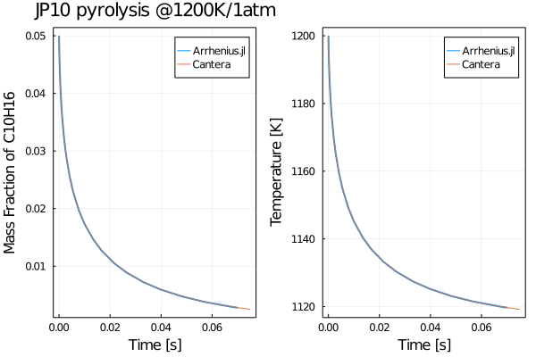

# Arrhenius

Inspired by [`ReactionMechanismSimulator.jl`](https://github.com/ReactionMechanismGenerator/ReactionMechanismSimulator.jl), this project aims at developing a mini package for interpreting combustion chemical kinetic models and compute reaction source term. The name of `Arrhenius.jl` is reflecting the fact that the distinction between combustion and other chemical reacting flow are temperature-dependent kinetics and large activation energy.

`Arrhenius.jl` is designed with following in mind:

* [Combustion software 2.0](https://www.linkedin.com/pulse/arrheniusjl-combustion-software-20-weiqi-ji/)
* [Differential programing](https://github.com/Cantera/enhancements/issues/82)
* [Physics informed machine learning](https://github.com/Cantera/enhancements/issues/82)
* Combustion simulation education.

We are in an early-development. Expect some adventures and rough edges.

## Installation

> pkg> add https://github.com/DENG-MIT/Arrhenius.jl

## Usage

You can start from the example of pyrolysis of JP10 (an aviation fuel power the flight) under the folder of `example`. It will guide you on how to implement the governing equations with a couple of lines of code. You will also learn how to use `ForwardDiff.jl` to **differentiate the solver**.

> Currently, the package relies on [`Cantera`](https://github.com/Cantera/cantera) and [`ReacTorch`](https://github.com/DENG-MIT/reactorch) for interpreting the reaction mechanism. If you want to have a try, you don't need to install Cantera and ReacTorch, since there are already some pre-compiled reaction mechanisms under the folder of `mechanism`. Otherwise, you can install [`Cantera`](https://github.com/Cantera/cantera) and [`ReacTorch`](https://github.com/DENG-MIT/reactorch) to compile it using the python script `interpreter.py` under the folder of `mechanism`. You can also ask for help in the discussion forum and our developers can compile the model for you.

**Examples**

> Note that some of the examples are in development and you can have early access by contacting [Weiqi Ji](mailto:weiqiji@mit.edu)
  + [Active Subspace of Reaction Mechanism](https://github.com/DENG-MIT/ArrheniusActiveSubspace)
  + [Pyrolysis of JP10](./example/pyrolysis/pyrolysis.ipynb)
  + [Perfect Stirred Reactor](./example/perfect_stirred_reactor)
  + [Auto-ignition](https://github.com/DENG-MIT/NN-Ignition): 
      + adjoint sensitivity to prefactor A and activation function using AD
      + sensitivity using BVP methods and AD flies with @distributed parallization (orders of magnitute faster)
  + [Compute Jacobian using AD](https://gist.github.com/jiweiqi/21b8d149bd95b97d9ae948ab92e446df)
  + [Couple with CRNN and Neural ODEs](https://github.com/DENG-MIT/CRNN_HyChem)
  + Deep Reduction: Two-stages mechanism reduction with deep learning

## Validation with Cantera

In the example of pyrolysis.jl, we compare the results with Cantera. The example involves solving the equations of mass fractions and temperature under constant pressure.

