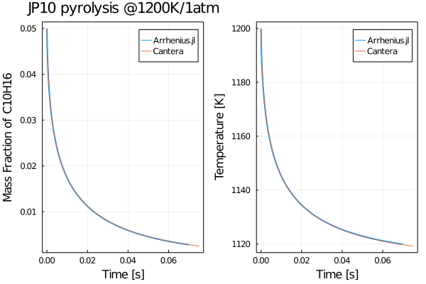

# Arrhenius

Inspired by [ReactionMechanismSimulator.jl](https://github.com/ReactionMechanismGenerator/ReactionMechanismSimulator.jl), this project aims at developing a mini package for interpreting combustion chemical kinetic models.

The package name of `Arrhenius.jl` is reflecting the fact that the distinction between combustion and other chemical reacting flow is temperature dependent kinetics and large activation energy.

## Installation

> pkg> add https://github.com/DENG-MIT/Arrhenius.jl

## Usage

Currently, the package rely on `Cantera` and `ReacTorch` for interpreting reaction mechanism. Therefore, you shall install Cantera and ReacTorch first, and run the python script `interpreter.py` under the folder of `python`.

You can start from the example of pyrolysis of JP10 (an aviation fuel power the flight) under the folder of `example`. You can implement the governing equations with couple of lines of code.

## Validation with Cantera

