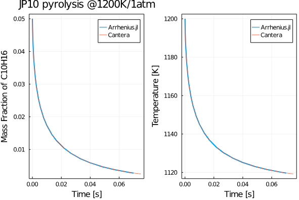

# Get Started
## Basics and Magic functions!
We first have to make Arrhenius.jl available in our code (along with other packages you might use):
```julia
using Arrhenius
```
The next step is to create the solution structure similar to Cantera by providing a YAML file as the input. The complete definition of the solution structure can be found [here](https://github.com/DENG-MIT/Arrhenius.jl/blob/a6e77fa501f8e1bfb0b4bd244b507f0bc10f1f8c/src/DataStructure.jl#L29). 
```julia
gas = CreateSolution("../../mechanism/JP10skeletal.yaml")

```
Note that you have to provide the appropriate location of the YAML file. Here we have in the ```../mechanism``` folder. You can find the number of species and reactions in the mechanism you provided using: 
```julia

ns = gas.n_species
nr = gas.n_reactions

```
To view the species that your mechanism uses:
```julia
species_arr = gas.species_names
```
You might also want to access a particular species' data. For instance, N2's index can be accessed using: 
```julia
index_N2 = species_index(gas,"N2")
```
To get the molecular weights of each gas: 
```julia
mol_wt_arr = gas.MW
```
Hence the mean molecular weight can be obtained as: 
```julia
mean_MW = 1. / dot(Y, 1 ./ gas.MW)
#get the density using the ideal gas law
ρ_mass = P / R / T * mean_MW
```
Note that one has to include ```using LinearAlgebra``` in the code to be able to use ```dot()```. One can easily convert between the mass and molar fractions:
```julia
X = Y2X(gas, Y, mean_MW)
C = Y2C(gas, Y, ρ_mass)
```
Some other commonly used thermodynamic functions are given below: 
```julia
#molar specific heats
cp_mole, cp_mass = get_cp(gas, T, X, mean_MW)
#molar enthalpies
h_mole = get_H(gas, T, Y, X)
#entropy
S0 = get_S(gas, T, P, X)
```
One of the core functionalities of the Arrhenius.jl is its ability to compute the source term that frequently appears in the governing equations of chemical systems. One can simply compute this using : 
```julia
w_dot = wdot_func(gas.reaction, T, C, S0, h_mole)
```
## Examples
### JP10 Pyrolysis
Let us compute the evolution of the mass fractions of C10H16 species as JP-10 is subjected to isobaric pyrolysis at 1 atm and an initial temperature of 1200K. We first include all our packages: 
```julia
using Arrhenius
using LinearAlgebra
using DifferentialEquations
using ForwardDiff
using DiffEqSensitivity
using Plots
using DelimitedFiles
using Profile
```
Then create the gas object: 
```julia
gas = CreateSolution("../../mechanism/JP10skeletal.yaml")
```
Declare the initial conditions as arrays: 
```julia
Y0 = zeros(ns)
Y0[species_index(gas, "C10H16")] = 0.05
Y0[species_index(gas, "N2")] = 0.95
T0 = 1200.0   #K
P = one_atm
u0 = vcat(Y0, T0);
```
Create a function to define the ODE problem (for more details on solving differential equations refer to [DifferentialEquations.jl](https://diffeq.sciml.ai/stable/). 
```julia
@inbounds function dudt!(du, u, p, t)
    T = u[end]
    Y = @view(u[1:ns])
    mean_MW = 1. / dot(Y, 1 ./ gas.MW)
    ρ_mass = P / R / T * mean_MW
    X = Y2X(gas, Y, mean_MW)
    C = Y2C(gas, Y, ρ_mass)
    cp_mole, cp_mass = get_cp(gas, T, X, mean_MW)
    h_mole = get_H(gas, T, Y, X)
    S0 = get_S(gas, T, P, X)
    wdot = wdot_func(gas.reaction, T, C, S0, h_mole)
    Ydot = wdot / ρ_mass .* gas.MW
    Tdot = -dot(h_mole, wdot) / ρ_mass / cp_mass
    du .= vcat(Ydot, Tdot)
end
```
Solve the ODE problem: 
```julia
tspan = [0.0, 0.07];
prob = ODEProblem(dudt!, u0, tspan);
sol = solve(prob, TRBDF2(), reltol=1e-6, abstol=1e-9);
```
Great! Let us now compare our solution with cantera by first loading the cantera data: 
```julia
cantera_data = readdlm("pyrolysis.dat")
ct_ts= cantera_data[:, 1]
ct_T = cantera_data[:, 2]
ct_Y = cantera_data[:, 3:end];
```
Now plot and compare away: 
```julia
plt = plot(sol.t, sol[species_index(gas, "C10H16"), :], lw=2, label="Arrhenius.jl");
plot!(plt, ct_ts, ct_Y[:, species_index(gas, "C10H16")], label="Cantera")
ylabel!(plt, "Mass Fraction of C10H16")
xlabel!(plt, "Time [s]")
pltT = plot(sol.t, sol[end, :], lw=2, label="Arrhenius.jl");
plot!(pltT, ct_ts, ct_T, label="Cantera")
ylabel!(pltT, "Temperature [K]")
xlabel!(pltT, "Time [s]")
title!(plt, "JP10 pyrolysis @1200K/1atm")
pltsum = plot(plt, pltT, legend=true, framestyle=:box)
```
You should get a plot something like this: 



### Exploiting Julia's Auto-Differentiation (AD) package to compute Jacobians
Julia's automatic differentiation packages like [```ForwardDiff.jl```](https://juliadiff.org/ForwardDiff.jl/stable/user/api/) can be exploited thoroughly using Arrhenius.jl to compute the Jacobian that frequently pops up while integrating stiff systems in chemically reactive flows. We present to you an example using the LiDryer 9-species H2 combustion mechanism. So let's import packages:
```julia
using Arrhenius
using LinearAlgebra
using DifferentialEquations
using ForwardDiff
using DiffEqSensitivity
using Plots
using DelimitedFiles
using Profile
```
Next input the YAML:
```julia
gas = CreateSolution("./mechanism/LiDryer.yaml")
```
We use a 9-species + 24-reaction model:
```julia
julia> ns = gas.n_species
9
julia> ns = gas.n_species
24
```
View the participating species:
```julia
julia> gas.species_names
9-element Array{String,1}:
 "H2"
 "O2"
 "N2"
 "H"
 "O"
 "OH"
 "HO2"
 "H2O2"
 "H2O"
```
Let's set the initial conditions: 
```julia 
Y0 = zeros(ns)
Y0[species_index(gas, "H2")] = 0.055463
Y0[species_index(gas, "O2")] = 0.22008
Y0[species_index(gas, "N2")] = 0.724457  #to sum as unity
T0 = 1100.0   #K
P = one_atm * 10.0
u0 = vcat(Y0, T0);
```
Create the differential function:
```julia
function dudt(u)
    T = u[end]
    Y = @view(u[1:ns])
    mean_MW = 1. / dot(Y, 1 ./ gas.MW)
    ρ_mass = P / R / T * mean_MW
    X = Y2X(gas, Y, mean_MW)
    C = Y2C(gas, Y, ρ_mass)
    cp_mole, cp_mass = get_cp(gas, T, X, mean_MW)
    h_mole = get_H(gas, T, Y, X)
    S0 = get_S(gas, T, P, X)
    wdot = wdot_func(gas.reaction, T, C, S0, h_mole)
    Ydot = wdot / ρ_mass .* gas.MW
    Tdot = -dot(h_mole, wdot) / ρ_mass / cp_mass
    du = vcat(Ydot, Tdot)
end
```
Now computing the jacobian w/ref to the initial condition vector is as simple as: 
```julia
julia> @time du0 = ForwardDiff.jacobian(dudt, u0)
 0.026856 seconds (18.37 k allocations: 1.047 MiB)
10×10 Array{Float64,2}:
  -0.00227393    -0.000934232   0.000137514  …   0.000213839  -5.21262e-6
  -0.0360919     -0.0148282     0.00218263       0.00334244   -8.27348e-5
   0.0            0.0           0.0              0.0           0.0
   0.00113697     0.000467116  -6.87571e-5      -0.000106919   2.60631e-6
   2.09985e-12    2.28459e-12  -1.26987e-13      2.97389e-12   2.53222e-14
   0.0            0.0           0.0          …   2.74378e-5    0.0
   0.0372289      0.0152953    -0.00225138      -0.00344774    8.53411e-5
   0.0            0.0           0.0              0.0           0.0
   0.0            0.0           0.0             -2.9064e-5     0.0
 -27.3692       -47.4374       16.5061          29.0894       -0.306451
```
### Sensitivity analysis of ignition delay times-Active subspaces
## Perfect Stirred reactor 
## Computing Jacobians 
## Auto-ignition
## Exploiting Auto-differentiation 
